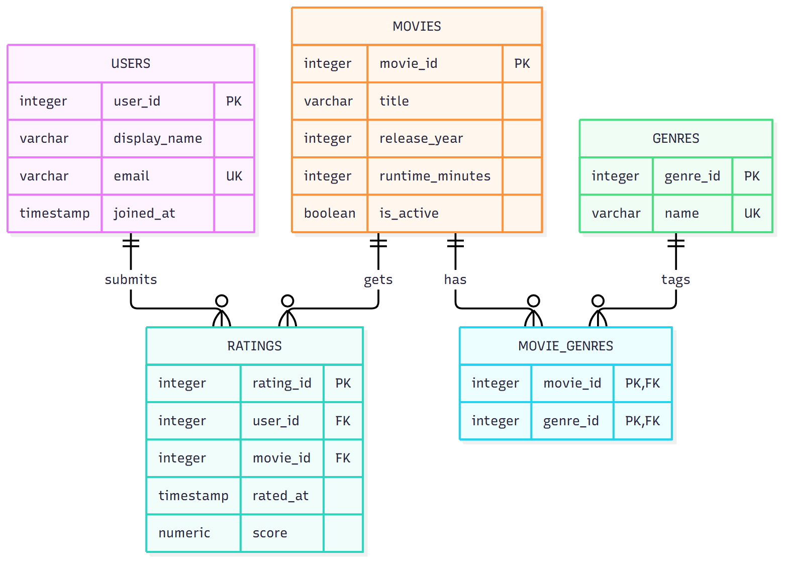

# Movie / TV Ratings Database

A relational design for a platform where users rate movies and movies are classified by genre.

**Author:** Nicholas Ku
**Course:** EX 603, Data and Algorithms for Scalable Systems
**Theme:** Movie / TV

## Domain

This platform lets people rate movies on a half star to five star scale. Users are the actors, movies are the thing being rated, and each rating is recorded as its own event with a timestamp and a score. Movies are classified by genre, and a movie can carry several genres at once, which makes the movie to genre link many to many.

The platform has to answer questions about the movies and about the people rating them. Which movies have the highest average score once a minimum number of ratings is met? Which genres draw the most activity? How many ratings does a movie receive per month? Which users rate the most, and which active movies of a given length are still unrated? Ratings is the high-volume table, so the design aims to keep these questions simple aggregates.

The schema also has to reject invalid state by itself. A score outside the scale, a duplicate rating by the same user on the same movie, a rating for a movie that does not exist, and a movie tagged twice with the same genre should all be impossible to store, whichever application or script does the writing.

## Schema



The editable diagram source is [schema/erd.mmd](schema/erd.mmd), written in Mermaid.

| Role | Relation | Purpose |
|---|---|---|
| actor | `users` | The person who rates movies |
| producer | `movies` | The title being rated |
| event | `ratings` | One rating action, with a timestamp and a score |
| catalog | `genres` | The categories that classify movies |
| junction | `movie_genres` | The many to many link between movies and genres |

### Design decisions to notice

- Every table has a generated INTEGER key. Display names and titles repeat, so none of them can identify a row. Email and genre name are protected by UNIQUE constraints instead.
- A user holds at most one rating per movie. A re-rating updates the existing row, which keeps averages and top-rated lists as plain aggregates.
- `movie_genres` uses the pair of foreign keys as its primary key, so a movie cannot be tagged with the same genre twice.
- A rated movie cannot be deleted. It is retired with `is_active = FALSE`, so rating history is never lost by accident. Deleting a user removes their ratings.
- No derived value is stored. Averages and counts are computed at query time.

## How to run it

Create an empty database, then run the script from the `schema` folder. It drops and rebuilds the five tables, so it can be run repeatedly.

```bash
psql -d your_database -v ON_ERROR_STOP=1 -f schema/schema.sql
```

## Contents

| Path | What it holds |
|---|---|
| [schema/schema.sql](schema/schema.sql) | The complete DDL script, runnable top to bottom on an empty PostgreSQL 14+ database |
| [schema/schema-definition.md](schema/schema-definition.md) | Relation schemas, attributes, domains, and primary keys |
| [schema/constraints.md](schema/constraints.md) | Integrity constraints and the ON DELETE choice for each foreign key |
| [analysis/unit1.md](analysis/unit1.md) | Unit 1 modelling justification and reflection |
| [analysis/unit2.md](analysis/unit2.md) | Unit 2 constraints table, CHECK narrative, and what changed from Unit 1 |
| `queries/` | Empty until a later unit |
| [screenshots/](screenshots/) | Execution evidence |
